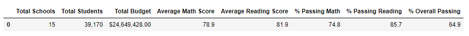
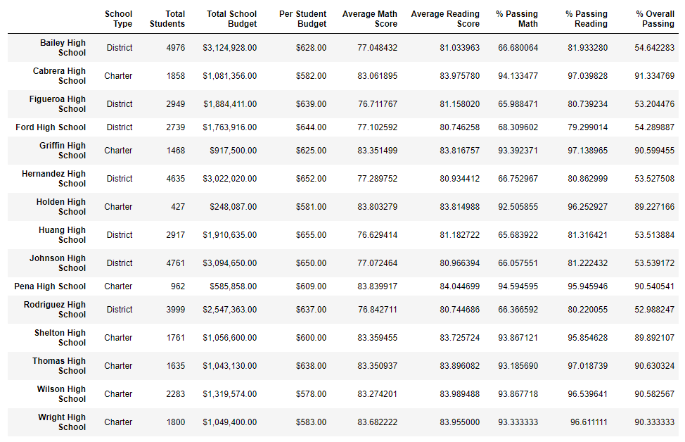

# School District Analysis

## Overview of Project:

Using python code and pandas to perform an analysis of a school district with district, school, and class subject summary tables generated.

### Purpose:

Python code and pandas are used to perform an analysis of a school district's data set.  This allows for quick processing and analysis of a large data set to develop summary tables that communicate findings to further analysis and deductions about the data.  Summary tables for the district, the schools in the district, and additional details for the schools were developed.  

While processing the data set, there was evidence that the ninth grader math and reading scores from Thomas High School appeared to be altered.  To not influence the analysis summaries, these scores were removed and Thomas High School percentages were replaced to only reflect the school's tenth through twelfth graders' scores.  

## Analysis Results and Challenges:

### Analysis of Outcomes 

The district summary for the math, reading, and overall passing percentages were minorly affected by removing the Thomas High School's ninth grader math and reading scores.  After score removal, the district summary math and reading percentages rose by approximately 0.1% while the overall passing percentage rose by approximately 0.2%.  Since it was only one grade level from one school that was removed from the data set, the overall district summary was not significantly impacted but more focused school summary tables created from the dataset reflect the dataset modifications more clearly.

#### Updated District Summary

The school summary row for Thomas High School was updated to reflect higher math, reading, and overall passing percentages when the ninth grader scores were removed.  The math passing percentage rose from 66.9% to 93.2%; the reading passing percentage rose from 69.7% to 97.0%; and the overall passing percentage rose from 65.1% to 90.1%

#### Updated School Summary

By removing the ninth grader's math and reading scores and updating the student count for passing percentage calculations to only include tenth through twefth graders, the overall passing percentage for Thomas High School rose.  Because the ninth graders' math and reading passing percentages were low, their scores were dropping the school's passing percentages when they were included in the total school's statistics.

When Thomas High School's math, reading, and overall percentages were re-calculated after removing the ninth graders' scores, Thomas High School became a Top 5 school in the district.

### Additional Results with Dataset Modification

When the ninth-grade scores were removed, the following affects are observed:

-- Math and reading scores by grade summary tables: the summary tables show that the ninth graders' math and reading scores where replaced to "NaN" (Not a Number) to reflect that their scores were not included in the math, reading, and overall percentage calculations.  Because they were removed, all ninth grade scores across schools in the district cannot be equally compared.

-- Scores by school spending:  there was no impact to the scores by school spending because the true total number of students at Thomas High School was included for the spending categorization (ninth graders were not excluded from that student count).  Even though the Thomas High School student count was modified to remove the ninth grades in the passing percentage calculations, the number of ninth graders needed to be included in the overall spending calculations because money is still spent on them at the school.  It was only the ninth graders' subject scores that were in question and not their attendance at school. 

-- Scores by school size:  as with school spending, the Thomas High School ninth graders need to remain in the total school count to account for their attendance at the school. Removing the ninth graders' with the student count is relevant for their infuence on the passing percentages for math and reading but not relevant for comparing the categories of school sizes within the district.

-- Scores by school type:  the ninth graders' scores and impact on school passing percentages are irrelevant to the categorization of Thomas High School's school type as their scores would not change that Thomas High School is a Charter school.  But, if the school type was a filtering/correlation parameter, then the updated passing percentages (math, reading, overall) would affect how Thomas High School compares to other schools within the Charter school type categorization and how it impacts Charter schools compared to District schools.

### Challenges and Difficulties Encountered

No challenges were encountered during the analysis. But assumptions or additional actions that needed to be made include:

*No other evidence of academic dishonesty was found in other schools.

*To confirm some of the coding logic was correctly configured, addtional displays for new dataframes have been included in the cells.  Since many cells built upon each other, early verification on coding results avoided the need to debug large blocks of code to find/correct any errors encountered.

*In reviewing the included code, there are re-factoring opportunities available should this analysis need to be performed with any higher frequency or larger datasets in order to streamline the processing/analysis to produce the summary tables.

## Summary

In summary of this school district analysis, the following four major changes were found after reading and math scores for ninth graders at Thomas High School were replaced with NaNs:

1.  Thomas High School changed to be a top 5 performing school in the district based on their updated overall passing percentage.

2.  Thomas High School's updated math and reading passing percentages were closer to other Charter school passing percentages in the District than prior to the ninth grade score changes.  Prior to the change, Thomas High school passing percentages where approximately 25-30% lower than other Charter schools

3.  Thomas High School's updated overall passing percentage was closer to other Charter schools' overall passing percentages in the District than prior to the ninth grade score changes.  Prior to the change, Thomas High School's overall passing percentage was approximately 25% lower, excluding it from being a top 5 performing school.

4.  If Thomas High School's ninth grade scores were not removed, the School Types category comparison would have been affected as the Charter school type passing percentages would have been lower.  In particular, the reading passing percentage comparison between Charter and District schools is closer than in math and overall percentages.  If the reading passing percentage between Charter and District schools was only marginally different, it would obscure any differences actually executed between Charter and District schools or would not trigger further thought/analysis to even be made that could make a difference.
 
